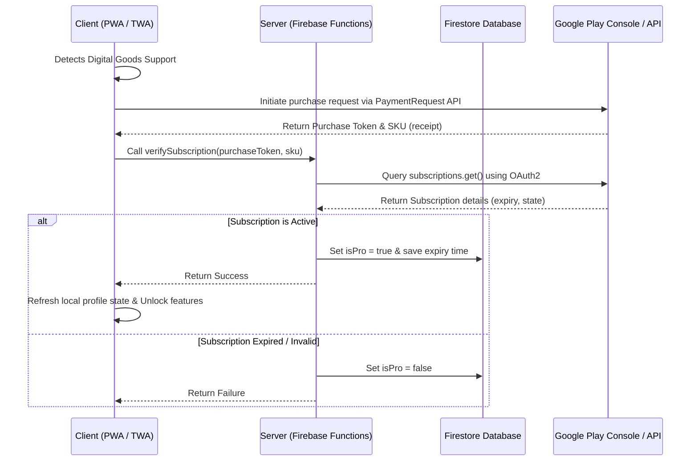

# Play Store Subscription Integration Guide (PWA/TWA)

This document provides a technical walkthrough of how Google Play Store subscription monetization is implemented in this application. You can use this as a reference and instruction manual for Antigravity or any other coding assistant to implement similar flows in other projects.

---

## 1. Architectural Overview

The subscription architecture uses a secure **Client-Server-Google** model:



---

## 2. Frontend Billing Bridge (`useGoogleBilling.ts`)

For PWAs running in a **Trusted Web Activity (TWA)** wrapper on Android, Google Play Billing is integrated using the **Digital Goods API** alongside the standard web **PaymentRequest API**.

### Key Flow:
1. **Support Check**: Verify if `getDigitalGoodsService` is present in the `window` object.
2. **Product Details Lookup**: Establish connection with Google Play's billing provider (`https://play.google.com/billing`) to verify product existence and pull local pricing, currency, and titles.
3. **Transaction Request**: Instantiate a `PaymentRequest` indicating `https://play.google.com/billing` as the supported method and provide the target `sku`.
4. **Backend Verification**: Call the server-side verification Cloud Function with the returned `purchaseToken` and `sku`.
5. **Acknowledge/Complete**: Notify the client browser that the payment request was finished successfully using `response.complete('success')`.

### Reference Implementation snippet:
```typescript
const handlePurchase = async (sku: string) => {
    // 1. Resolve play store billing service
    const service = await window.getDigitalGoodsService("https://play.google.com/billing");
    const details = await service.getDetails([sku]);

    if (details.length === 0) throw new Error("Product SKU not found");

    // 2. Build Web Payment Request
    const request = new PaymentRequest([{
        supportedMethods: "https://play.google.com/billing",
        data: { sku }
    }], {
        total: {
            label: details[0].title,
            amount: { currency: details[0].price.currency, value: details[0].price.value }
        }
    });

    // 3. Prompt Google Play overlay
    const response = await request.show();
    const { purchaseToken } = response.details;

    // 4. Validate on Backend Cloud Functions
    const verified = await verifyPurchaseOnBackend(purchaseToken, sku);
    
    // 5. Complete standard client-side transaction
    await response.complete(verified ? 'success' : 'fail');
};
```

---

## 3. Server-Side Verification (`verifyVendorSubscription` Cloud Function)

All security logic and direct Firestore database updates live strictly on the server in [`functions/src/index.ts`](file:///home/ulrik/Desktop/Projects/Personal/Sosika/Sosika/functions/src/index.ts).

### Dependencies:
- **`googleapis`**: For interacting with the Google Play Developer API v3 (supporting Play Billing Library v8+).
- **`firebase-admin`**: For writing subscription metadata directly to the vendor's Firestore record (`vendors/{vendorId}`).
- **`firebase-functions`**: 2nd Generation Cloud Functions (`onCall`).

### Key Logic:
1. **Google OAuth2 authentication**: Load service account credentials to access scope `"https://www.googleapis.com/auth/androidpublisher"`.
2. **Retrieve receipt details**: Query `androidPublisher.purchases.subscriptionsv2.get` with `packageName` and `token` (purchaseToken), falling back to `subscriptions.get` for legacy product SKUs.
3. **Validate Subscription State**: Determine subscription viability by checking:
   - **Subscription State**: `SUBSCRIPTION_STATE_ACTIVE` or `SUBSCRIPTION_STATE_IN_GRACE_PERIOD`.
   - **Line Item Expiry**: Ensures `expiryTime` is in the future.
4. **Persist States**:
   - Write `subscription.tier = "premium"`, `subscription.status = "active"`, `subscription.purchase_token`, and feature flags (`analytics`, `recommendations`, `sms_notifications`) to the vendor's Firestore document.
   - If validation fails, safely reset `subscription.tier = "free"`.

### Active State Validation Rules:
```typescript
const isSubscriptionActive = (
    paymentState: PaymentState | undefined,
    expiryTimeMillis: string | null | undefined,
    cancelReason: number | null | undefined
) => {
    const now = Date.now();
    const expiryTime = parseInt(expiryTimeMillis || "0", 10);

    if (expiryTime > 0 && expiryTime < now) {
        return { isActive: false, reason: "Expired" };
    }
    if (cancelReason !== undefined && cancelReason !== null) {
        if (expiryTime > now) {
            return { isActive: true, reason: "Active but cancelled. Expiries soon." };
        }
        return { isActive: false, reason: "Cancelled" };
    }
    return (paymentState === 1 || paymentState === 2 || paymentState === 3) 
        ? { isActive: true, reason: "Active" } 
        : { isActive: false, reason: "Inactive State" };
};
```

---

## 4. Database Schema Design (Firestore)

A dedicated User Profile document stores the billing status.

```typescript
export interface UserProfile {
    uid: string;
    email: string;
    isPro: boolean;
    invoiceCount: number;
    allowedInvoices: number;
    // Extra fields updated during Cloud Function verification:
    subscriptionExpiry?: number;   // Epoch timestamp
    subscriptionSku?: string;      // Identifier of the active tier
    lastVerified?: Timestamp;      // Last check epoch
}
```

---

## 5. Client Gating Mechanisms

Access controls are implemented both client-side (for UI rendering/blocking) and database-side (Firestore rules/write functions).

### A. Creation & Action Gating
Before initiating actions, check `isPro` status or current usage count.
```typescript
const limit = userProfile.allowedInvoices || 5;
if (!userProfile.isPro && userProfile.invoiceCount >= limit) {
    throw new Error("Free limit reached. Please upgrade to Pro.");
}
```

### B. UI / Feature Gating
1. **Interactive Element Disabling**: Lock editing forms, templates, or advanced inputs based on status:
   ```tsx
   <input disabled={!isPro} className={!isPro ? "opacity-50 cursor-not-allowed" : ""} />
   ```
2. **Visual Gating (Blurring)**: Restrict access to premium panels (e.g. analytics graphs or custom logs) by applying CSS blur effects and overlays:
   ```tsx
   <div className={clsx("h-[250px]", !isPro && "blur-sm pointer-events-none")}>
       <AnalyticsChart />
   </div>
   ```

### C. Direct Action Gating
For batch outputs or PDF downloads:
```typescript
if (!isPro && selectedItems.length > 1) {
    alert("Batch operations are available to Pro users only!");
    return;
}
```

---

## 6. Subscription Management & Cancellation

Because Google Play Billing is managed directly on Android devices/Play Store Accounts, the app implements a simple redirect to let users cancel or change tiers.

In the user settings, a direct anchor is provided:
- **URL**: `https://play.google.com/store/account/subscriptions`
- **Behavior**: Opens in a new window/tab, allowing users to securely manage payments on their Google Play profile.
- **Reference**:
  ```tsx
  <a
      href="https://play.google.com/store/account/subscriptions"
      target="_blank"
      rel="noopener noreferrer"
  >
      Cancel Subscription
  </a>
  ```
