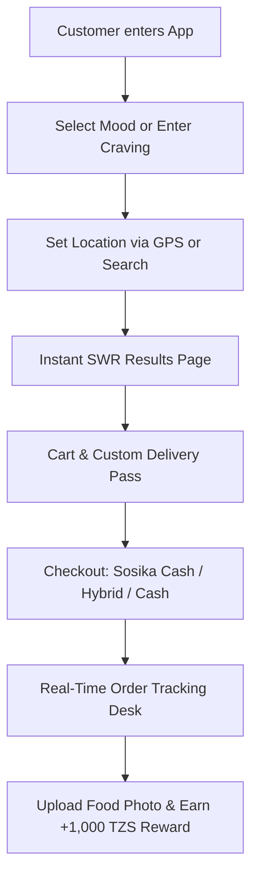

# 🚀 Sosika Platform — Executive Pitch Deck Report

> **Document Purpose**: Comprehensive technical, business, and product overview of **Sosika** designed to assist in crafting investment pitch decks, executive summaries, and partnership proposals.

---

## 📌 1. Executive Summary

**Sosika** is a modern Progressive Web Application (PWA) food discovery, recommendation, and delivery ecosystem designed for African urban markets and university campuses (starting in Tanzania). 

Unlike legacy food delivery platforms that rely on rigid restaurant list browsing, Sosika introduces **Mood-Based & Craving-Based Food Discovery**, **Sosika Cash Digital Wallet**, and a crowdsourced **Food Photo Rewards Ecosystem**.

### Key Highlights:
- **Core Value Proposition**: "Discover food by how you feel." Intelligent mood matching pairs customer cravings (e.g., Breakfast, Lunch, Late Night, Chips Mayai, Fast Snacks) with nearby verified merchant spots.
- **Ecosystem Architecture**: Customer PWA App, Merchant/Vendor Operational Portal, and System Admin Command Control Tower.
- **Micro-Ecosystem Wallet & Rewards**: Integrated **Sosika Cash Wallet** with Lipa Namba top-ups and a **+1,000 TZS Meal Photo Upload Reward** program that gamifies menu photo acquisition.
- **Frictionless Onboarding**: Phone-number-first guest checkout requiring zero password hurdles.

---

## 🎯 2. Market Problem & Sosika Solution

### The Problem
1. **High Friction in Food Discovery**: Customers on university campuses and urban centers struggle to find meals matching specific moods, prices, or immediate cravings without scrolling through irrelevant vendor menus.
2. **Outdated & Missing Vendor Media**: Local food spots (*Mama Ntilie*, fast food joints, campus vendors) lack professional food photography, reducing customer trust and online conversion.
3. **Payment Barriers**: Traditional card payments have low penetration in East Africa. Customers rely on Mobile Money (M-Pesa, Tigo Pesa, Airtel Money) and cash on delivery.
4. **Slow Apps & Heavy Bandwidth**: Legacy food apps load slowly on mobile networks and consume excessive data.

### The Sosika Solution
1. **Mood-Based Discovery Engine**: Instant search powered by client-side SWR caching and location proximity filters.
2. **Crowdsourced Food Photo Rewards**: Customers earn **1,000 TZS Sosika Cash** for uploading photos of their received meals. Admin approval credits the wallet and instantly sets the image as the vendor's official menu picture.
3. **Sosika Cash Wallet + Lipa Namba**: Seamless wallet payments integrated with mobile money Lipa Namba (`656313666`) and hybrid payment options (Wallet + Cash on Delivery).
4. **Ultra-Fast PWA Architecture**: Built with React, Vite, Tailwind CSS, and SWR caching for 0ms initial cached screen renders.

---

## 🛠️ 3. Core Product Features & User Flows



### A. Customer Experience (`/mood`, `/mood/location`, `/mood/results`)
- **Mood Selector**: Curated options ("Breakfast", "Lunch", "Dinner", "Snacks", "Drinks") or custom text cravings.
- **Interactive Location Picker**: Leaflet / Google Maps geolocation with campus preset shortcuts.
- **Instant Mood Results**: Optimized SWR query pipeline returning vendor distance, availability, price ranges, and verified food photos.
- **Free Delivery Pass**: Automated 3-use free delivery pass renewed bi-weekly per customer phone number.
- **Order Tracking Console (`/track/:orderId`)**: Real-time Firestore order status tracker (`pending` ➔ `preparing` ➔ `ready_for_pickup` ➔ `delivered`).

### B. Sosika Cash & Rewards Ecosystem (`/orders`)
- **Sosika Cash Wallet**: Customer digital wallet indexed by E.164 phone number (`+255...`).
- **Lipa Namba Top-Ups**: Top up via Lipa Namba `656313666` with interactive projected balance calculator (`Current Balance ➔ Top-Up Amount ➔ Projected Balance`).
- **Photo Upload Rewards**: Customers upload meal photos post-delivery to earn TZS 1,000 credit per item.

### C. Merchant / Vendor Portal (`/vendor-portal`)
- Real-time order reception sound notifications and status updates.
- Operational channel controls (`Open/Closed` toggle, stock availability).
- Menu item price management and category creation.

### D. System Admin Control Tower (`/admin/dashboard`)
- **Live Overview & Analytics**: Real-time GMV revenue (TZS), active order counter, verified vendor directory, wallet liability totals, and live session stream (`app_entries`).
- **Live Orders Dispatch Desk**: Real-time order monitoring across the entire platform with **Emergency Admin Status Override** and 1-tap WhatsApp customer contact shortcuts.
- **Vendor Directory & Catalog Manager**: Approve/deactivate merchants, upload vendor cover images, and perform **Bulk JSON Catalog Imports**.
- **Photo Rewards Moderation Stream**: Review customer meal uploads with 1-tap `Approve + Set as Official Menu Image` (+1,000 TZS credited atomically to user wallet) or `Reject`.
- **Wallet Console**: Search customer balances by phone number, execute manual Lipa Namba credits/refunds, and inspect the complete transaction audit ledger.

---

## 💻 4. Technology Stack & Technical Architecture

| Layer | Technology | Purpose |
| :--- | :--- | :--- |
| **Frontend Framework** | React 18 with TypeScript | Type-safe, modular SPA architecture |
| **Build & Tooling** | Vite v6 | Ultra-fast HMR and bundle compilation |
| **Styling & Theme** | Tailwind CSS (Custom Dark Theme) | Plus Jakarta Sans typography + Titillium Web logo font |
| **PWA & Offline** | Vite PWA Plugin & Workbox | Progressive Web App installability and service worker precaching |
| **State & Data** | Zustand & React Context | SWR-inspired cache (`mood-api.tsx`) with 0ms instant mount renders |
| **Backend & Database** | Firebase Firestore & Auth | Real-time `onSnapshot` listeners and indexed collection queries |
| **Media Storage** | Cloudinary & Firebase Storage | High-performance image hosting and optimization |
| **Mapping & Location** | Leaflet & OpenStreetMap | Open-source map rendering and geolocation distance calculations |
| **Search Engine** | Fuse.js | Fast fuzzy searching for food names, categories, and tags |

---

## 💰 5. Monetization & Business Model

1. **Vendor Commission Fees**: Percentage fee earned per completed merchant order.
2. **Delivery & Service Fees**: Distance-based delivery fee structure with campus delivery passes.
3. **Wallet Ecosystem Float**: Customer prepaid funds stored in the Sosika Cash Wallet ecosystem.
4. **Featured Merchant Listings**: Promoted placement for vendor spots on the mood results feed.

---

## 📊 6. Key Metrics & Traction Capabilities

- **Multi-Format Phone Normalization**: Automatically matches orders across E.164 (`+255...`), 12-digit (`255...`), and local (`07...`) formats, ensuring zero lost order history.
- **Performance Optimized**: Sub-second API response times using SWR memory caching and parallelized Firestore batch reads (`Promise.all`).
- **Crowdsourced Media Pipeline**: Self-sustaining menu imagery generation reducing merchant onboarding overhead by 90%.

---

## 🛠️ 7. File & Codebase Structure Reference

```
src/
├── App.tsx                         <-- Main Router & Page Wrapper
├── context/
│   ├── OrdersContext.tsx           <-- Multi-format phone order sync & history
│   ├── WalletContext.tsx           <-- Sosika Cash wallet state
│   └── cartContext.tsx            <-- Global shopping cart & delivery pass
├── pages/
│   ├── mood/                       <-- Mood selection, location & SWR results
│   ├── orders/                     <-- Orders history, tracking & photo rewards
│   ├── admin/Dashboard.tsx         <-- System Admin Control Tower
│   └── vendor-portal/              <-- Merchant portal & order management
└── components/
    ├── admin/                      <-- Modular Admin Dashboard sub-components
    └── my-components/              <-- TopUpWalletModal, CartDrawer, PhotoUploadModal
```

---

*Report compiled for Sosika Platform Pitch Deck Generation.*
