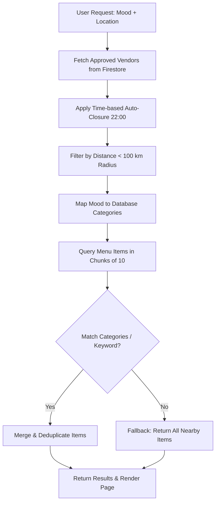

# Mood-Based Food Discovery & Recommendation Flow

This directory contains the user interface and logic for the **Mood-Based Recommendation** feature of Sosika. It is a client-side Progressive Web App (PWA) feature allowing users to discover dishes and restaurants matching their cravings, mood, or time of day, and location.

---

## 🗺️ User Flow Architecture

The user journey is divided into three key steps:

### 1. Mood Selection (`/mood`)
* **Component:** `MoodSelection.tsx`
* **Features:**
  * **Time-aware Suggestions:** Automatically detects the current hour and prioritizes meal types matching the time of day (e.g., *Breakfast* from 05:00 to 11:00, *Lunch* from 11:00 to 16:00, *Dinner* from 16:00 to 23:00).
  * **Quick Mood Cards:** Features cards for Drinks, Snacks, Nearby, or the current time-aligned meal option.
  * **Custom Craving Search:** Input bar supporting autocomplete or custom search terms (e.g., "biryani", "coffee") with interactive "Find Food" / "Surprise Me" triggers.
  * **State Management:** Persists selected mood globally in the `useMood` Zustand store.

### 2. Location Selection (`/mood/location`)
* **Component:** `LocationSelection.tsx`
* **Features:**
  * **Interactive Google Map:** Integrated map container showing the chosen coordinate marker.
  * **Google Places Autocomplete:** A search input to lookup addresses and places.
  * **Browser Geolocation:** "My Location" button automatically retrieves user GPS coords and reverse-geocodes them.
  * **Recent Locations:** Displays a quick-access list of up to 3 recently used locations persisted in LocalStorage via the `useLocationStorage` custom hook.
  * **Workflow Redirection:** Supports both normal discovery results forwarding and direct-to-checkout forwarding (`isOfferFlow`).

### 3. Food Discovery Results (`/mood/results`)
* **Component:** `ResultsPage.tsx`
* **Features:**
  * **Item-Centric Discovery:** Prioritizes menu item cards over vendor cards to reduce user friction.
  * **Direct Cart Operations:** Incorporates direct "Add to Cart" capability using the `useCartContext` hook.
  * **Local Filtering & Search:** Offers search-within-results input and category filter pills dynamically generated from matching items.
  * **Vendor Scroll:** Displays a horizontal scroll of nearby active restaurants sorted by distance and open/closed status.
  * **Pagination:** Implements client-side slicing (staggered 15-item chunks) with a "Load More Items" trigger to optimize DOM rendering performance.

---

## ⚙️ Query & Recommendation Engine

The matching system is defined in `api/mood-api.tsx` and executes the following algorithm when `fetchMoodResults` is invoked:

### 1. Vendor Filtering & Operational Rules
* **Verification Gate:** Only approved vendors (`is_approved` or `auth_info.is_approved`) are loaded.
* **Auto-Closure Override:** If the current hour is between **22:00 (10:00 PM)** and **06:00**, all vendors are forced closed (`is_open = false`), regardless of database status.
* **Proximity Filter:** Calculates distances using the Haversine formula (`calculateDistance`) and filters out vendors further than **100 km** from the user's selected coordinates.
* **Closed Visibility:** During nighttime closure, vendors are not filtered out of results but appear with a gray **Closed** pill and have their "Add to Cart" triggers disabled.

### 2. Menu Item Filtering & Fallbacks
* **Category Mapping:** Cravings/moods map to database category arrays via `mapMoodToCategories` (e.g., `breakfast` -> `["breakfast", "sandwiches"]`).
* **Chunked Fetching:** Queries Firestore `menuItems` using `where("vendor_id", "in", chunk)` in chunks of **10** to comply with Firestore's `in` query limitation.
* **Keyword Matching:** Client-side parses item titles containing the lowercase mood keyword.
* **Dynamic Fallback:** If zero dishes match the specific mood category or keyword, `isFallback` is set to `true` and all dishes from nearby vendors are returned with an warning banner notifying the user.

---

## 🛠️ Data Types

All data structures are typed in `types/types.ts`:
* **`Vendor`**: Represents merchant profiles, including name, location, and metadata.
* **`MenuItem`**: Represents individual dishes, containing price, category, and availability fields.
* **`Review`**: Type declaration for merchant/dish ratings.
